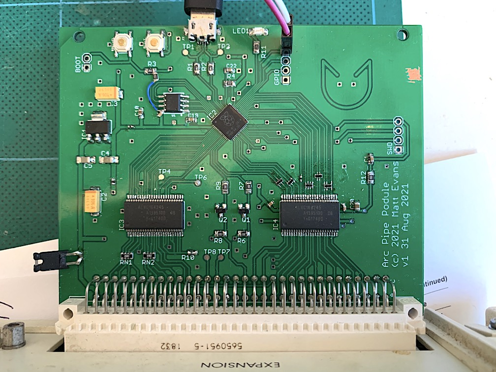

# RP2040-based Acorn Archimedes expansion card

22nd October 2021

This is a design for an expansion card (or "Podule" in Acorn-words) for the Acorn Archimedes computer.  Instead of the traditional EPROMs and 74-series logic, or PALs, this card uses the Raspberry Pi RP2040 microcontroller to interface directly to the expansion card bus.

This allows the functionality of the podule to be largely software-defined in the RP2040 firmware.

The card comprises 5V-3.3V buffering, the MCU, QSPI flash and crystal, and a USB micro-B device port for both programming the MCU and communicating with it when in action.

In conjunction with the [arc2040podule firmware](https://github.com/evansm7/arc2040podule), this podule provides a source of boot-time loaded Relocatable Modules (up to ~2MB, or ~8MB with large SPI flash fitted!) and a USB comms link with a host computer which can be used for file transfer, networking, etc.

**This is a work in progress!**  Board v1 was simply an experiment to prove the basic operation.  See below: v1 required extensive modifications to function, so _please do not build V1_.

Yes, it's sort of overkill to have two 133MHz processors providing IO for an 8MHz processor, but that's 2021 vs 1987 for you.  The RP2040 is ideal for this task because one core can be dedicated to the realtime bitbanging Arc bus cycles, with the other core dealing with comms and providing the peripheral model.

## Features

  * Raspberry Pi RP2040 microcontroller
  * Software-defined presentation to Archimedes
  * 4KB of expansion address space
  * Supports up to 8MB QSPI flash; almost all is free for ROM modules 
  * Supports open-collector IRQ and reset of the Archimedes
  * USB interface to a host computer (reflash, comms)
  * Debug blinky LED
  * SWD header
  * Reset button
  * BOOT button next to the Reset button for awkward, but possible, one-handed programming-reboot
  * Spare GPIO pins to a header
  * Micro-SD connector via SPI

## Principle of operation

The expansion card bus (and control signals) pass through 74AVLC164245 16-bit bus transceivers, which interface the 5V Arc to the 3.3V MCU.  The lower 8 bits of data are bidirectional, and the direction of the lower byte of the transceiver `IC3` is controlled by the `PR/nW` podule bus signal (called `PRNW` here).

The RP2040 polls the `/IORD` and `/IOWR` strobes, `/PS` podule select line, and address lines.  When a strobe falls, the RP2040 emulates the corresponding read or write cycle by presenting/capturing data on the `D[7:0]` data bus.

All address lines, `LA[13:2]`, are presented to the RP2040, permitting the full 16KB region to be decoded.

This podule only supports IOC cycles.  The `/IORQ` & `/IOGT` signals are not connected, due to lack of free GPIO pins.

Similarly, the RP2040 doesn't have enough GPIO pins to support a 16-bit data bus, so we deal with 8.

The good news is this podule is verified to perform synchronous (and slow) accesses correctly (v1 with hacks below, see notes).  Fast accesses have not been tested yet.

The RP2040 circuit is unremarkable and largely follows the RP design guide.  The BOOT signal is brought to a switch, which (on reset) conveniently brings the RP2040 up in USB MSD programming mode.

Browse the [schematic](doc/podule_2040_sch.pdf) and [board layout](doc/podule_2040_sch.pdf).

# Change log

## v2:

Changes from v1:

  * All points/v1 problems below have been resolved (but crystal still on bottom).
  * One more GPIO available (removed `NRST_I`).  GPIO header now brings out 4x GPIOs, 3.3V and ground.
  * Micro-SD footprint using GPIOs (corresponding to SPI1 pins).

**v2 has not been validated yet**  Boards are on their way.

## v1:

Requested changes (AKA a critique/lessons learned/mistakes in v1):

  * There's a fair bit of clown routing on v1 (late night, rushing to bundle this PCB off with another, regular excuses apply).  Clean routing.
   * Make net widths more consistent, e.g. some power nets change, and some are inconsistent either side of a component.
  * The QSPI routing is bad, and the decoupling is bad.  Fix both.
  * 74AVLC164245s are more easily available in TSSOP.  Change from SOP.
  * Add footprint for DNF pullup on flash `/CS`
  * 3.3V LDO is in an inconvenient/less common package.  Change for one of the cheap/plentiful packages (e.g. SOIC8)
  * Remove the `NRST_I` net input:  I found a software reset handshake is easier/more useful than polling for hardware reset.  This then frees a valuable single GPIO, for...
  * ...Add DNF SD footprint as an experimental option on 3x spare GPIOs (retain 0.1" header too).  Use newly-acquired spare GPIO for `/CS`.
  * Bring out USB Vbus to a link, or diode to 5V/LDO.  This would permit the board to be flashed while the host Arc is off, or unplugged.
  * Replace Y1 crystal footprint with a more common/available crystal.  (See notes.)
  * Move crystal to same side as MCU.
  * Decoupling:  Ensure 1x 0.1uF per power pin, even closer.  Caps closer to vias.  Add 0.1uF to QSPI flash.
  * Make address lines contiguous:  software _can_ juggle them, but it's a pain (and slows down the max cycle time).
  * _Crucially important_: Add 33Ω series termination on lines between the GPIO pins and the '245s.  See notes.
  * Wire both BOOT and RESET to a 4-pin header, for extension to 2 external buttons (e.g. outside the case of the Arc).

### Notes/observations on v1

I built the pictured prototype v1 with a 2MB QSPI flash, W25Q16JVSNIQ.  The flash doesn't work properly:  it only works slow, and I couldn't get 4-bit mode running.  Suspect decoupling & routing.

Ringing on the address lines hit a high voltage (~4V) and upset the RP2040.  This was a pain to find.  This manifest as USB stopping working while the Archimedes was powered on, yet working perfectly when it was off.  Adding 33Ω series termination on the address lines fixed this: add footprints on all control/data lines too (can always populate with 0Ω if it creates a problem).

The RP2040 design guide example uses a crystal with:
 
  * 27pF caps
  * 1K resistor
  * Crystal having 50 ohm ESR and 18pF load capacitance

The design guide says load cap should be (C1*C2)/(C1+C2)+parasitic, which (as caps are equal) simplifies to (C1/2)+parasitic.
Choose 5pF for parasitic and:  5+27/2 = 18.5, so choose 18pF crystal.

A similar worked example at: <https://suntsu.com/engineering-services/suntsu-application-notes/crystal-load-capacitance/>

Crystals in a 4-pin package (as used in v1) with 50 ohms and 18pF are uncommon.  For v1 I bodged on an 18pF 50ohm crystal (in wrong package -- Mouser 729-F91200084), and used 27pF caps.  Worked well.

Investigate more commonly-available packages, e.g. 4-pin but 3.2x2.5 instead of 5x3.2.

# Licence

This work is copyright 2021 Matt Evans, and is licenced under the Creative Commons CC BY-SA 3.0 license.
